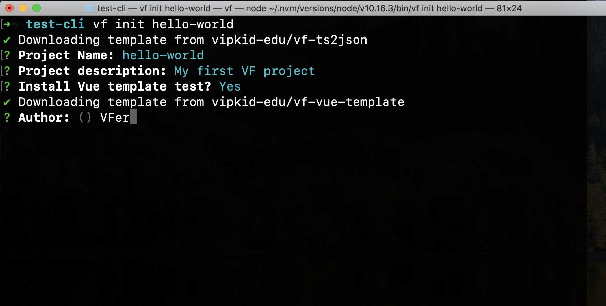

## 概览
VF-CLI 能帮你快速开发并自动产出 VF Engine 所需要的 JSON 数据 
   
## 安装
    npm install -g @vf.js/cli
## 使用
创建一个 VF 项目:

    vf init hello-world

最终结果如图：



### 初始化:

1. Project Name: 项目的名称
2. Project description(可选): 项目描述
3. Install Vue template test: 是否安装前端 Vue 模版项目，是否安装会产出不同的项目路径结构

不安装 Vue template 的结构为:

 ```
    hello-world
    |---build
    |---src
    |---types
    |---t2j.config.json
 ``` 

安装 Vue template 后的结构为:

```
hello-world
|----web
     |---build
     |---static
     |---vf-json
     |---index.html
     |---index.js
     |---...
|----ts2json
     |---build
     |---src
     |---types
     |---t2j.config.json
     |---...
       
```

其中安装后的结构，```ts2json/``` 文件夹里负责编写 Typescript，产出 JSON 文件到 ```web/`` 文件夹，
需要注意的是， ts2json 跟 web 是不同的服务，需要各启对应的服务

在 ts2json 里启动 ts to json 服务
```
cd ts2json
npm install 
npm run start
```

在 web 里启动前端 Vue 服务
```
cd web
npm install
npm run start
```


### ts2json 目录结构

```
    |-build // ts2json 的编译配置
    |-src // 在这里写业务，里面有一个简单的 demo 示例，可以按照你的业务需要自由删改
    |-types // 内置的类型约束文件，会随着 VF 持续迭代，如果有遗漏不全可能需要你先自行完善或告知我们
    |-t2j.config.json // ts2json 的配置选项
    |-其他常见配置文件
```
有关 ts2json 内部详细的配置请见 [帮助文档](https://github.com/vipkid-edu/vf-ts2json#how-to-use)

### web 目录结构
```
   |-build // 常见前端 build 配置
   |-static // 静态资源文件夹
   |-vf-json // 从 ts2json 产出的 json 文件会放在这里
   |-index.html 
   |-index.js
   |-App.vue 
```

### Engine 依赖
目前CLI没有内置 VF 引擎，如需引用请先自行安装。 有关引擎内嵌、更新提醒等功能正在开发
       
## 下一步
即将开发的特性

1. 引擎内嵌
2. 引擎更新提示
3. 持续完善 VF Engine 类型校验
3. CLI 更新提示

## 其他文档参考
待补充
